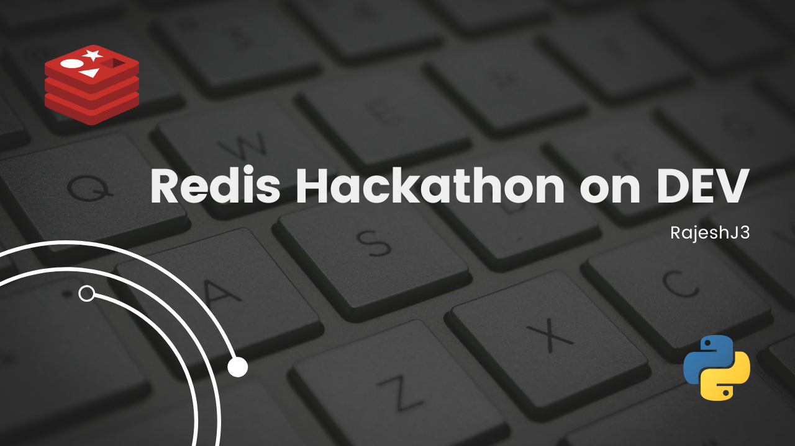

# eCommerce Store, inspired by 'GCP Microserves demo' | Redis Hackathon Submission

## Description

Infinite Blob is a cloud-first microservices demo application. The application is a web-based e-commerce store where users can browse digital items, add them to the cart, and purchase them. Backgrounds tasks like processing payments, invoice generation and sending emails are also there in the project.

It consists of 10-tier microservices. That are performing various tasks.

Inspired By [GCP Microserves demo](https://github.com/GoogleCloudPlatform/microservices-demo), this project is using similar architecture as GCP Microserves demo, but trying to use as much as Redis features as possible.

Services like, Invoice Generation and Sending Emails are completely Event Driven, using Redis' Pub/Sub Feature.

This Project is using the following features of Redis

- Storing Data in database with the help of `JSONModels` ✅
- Ads and Recommendation Engines are using features like `Querying and indexing` ✅
- Background Tasks like Generating Invoice and Sending Emails are using `Pub/Sub features` ✅

## Screenshots

| Home Page                                 | Product Page                                                     |
| ----------------------------------------- | ---------------------------------------------------------------- |
|  |  |

---

| Ad and Recomm.                                                         | Cart and Checkout Page                        |
| ---------------------------------------------------------------------- | --------------------------------------------- |
|  |  |

# Overview video

Here's a short video that explains the project and how it uses Redis:

[](https://www.youtube.com/watch?v=Xd8Kx3YMjZE)

## Architecture

**Infinite Blob** is composed of 10 microservices written in python.


## How it works

### How the data is stored:

- There are different ways, in which the data is been saved in the system.

  - In Database Models

    Using redis-om python client to create models.

    > Product Model

    ```python
    class Product(JsonModel, BaseModel):
        '''
        This model represents a single product
        '''
        # product basic info
        name: str = Field(index=True)
        description: Optional[str]

        # media
        thumbnail_url: str
        image_url: str

        # amount
        price: PositiveFloat = Field(index=True)

        # metadata
        tags: List[str] = Field(index=True)

        # analytics
        downloads: PositiveInt = Field(default=1)
    ```

    > Customer and Order Models

    ```python
    class Customer(EmbeddedJsonModel):
        '''
        This model represents a customer
        '''

        first_name: str
        last_name: str
        email: str


    class Order(JsonModel):
        '''
        This model represents a single order and it's embedded items
        '''
        # for authentication
        token: str = Field(index=True)

        # order details
        order_items: List[str]
        # init, pending, completed, cancelled
        status: str = Field(index=True, default="init")

        # customer
        customer: Optional[Customer]

        # other
        invoice_url: Optional[str]
    ```

    To save an instance of a Model the following way is used.

    > To save a Product instance sent via FastAPI request.

    ```python
    @app.post("/")
        async def products(product: Product):
            return product.save()
    ```

  - Sharing data between services using Pub/Sub

    Using instance of data models itself, we can construct the payload.

    ```python
    def publish(data, channel) -> None:
        '''
        Publish message to a particular channel
        '''
        resp = redis_db.publish(channel, json.dumps(data))
        print(f"Published to {channel}, now #{resp} message(s) pending.")


    channel = "payment"
    data = {"order": order.dict()} # order is instance of Order Model
    publish(data, channel)
    ```

### How the data is accessed:

- There are different ways, in which the data can be accessed in the system.

  - From Database Models

    > This is how to access all the products in a system, and return as FastAPI Response.

    ```python
      @app.get("/")
      async def all_products():
          all_pks = Product.all_pks()
          return [Product.get(pk) for pk in all_pks]
    ```

  - Revieving data from other service using Pub/Sub

    ```python
    def subscribe(channel, handler_function, *args, **kwargs):
        '''
        Subscribe to a channel to get messages.
        '''
        pubsub = redis_db.pubsub()
        pubsub.subscribe(channel)

        for index, message in enumerate(pubsub.listen()):
            if not index: continue

            data = message["data"]
            try: handler_function(json.loads(data), *args, **kwargs)
            except json.JSONDecodeError as e: print("[JSONDecodeError]", str(e))
            except Exception as e: print("[Exception]", str(e))


      # handle incoming message
      def handle_invoice(data: Order, *args, **kwargs): ...

      subscribe("invoice", handle_invoice)
    ```

### Performance Benchmarks

As compared to the previous case where GCP was using **Memorystore (redis)**, having a lot of limitations and constraints, this project is using **Redis Cloud**.

Redis Cloud provides customers real-time performance with linear scaling to **hundreds of millions of operations per second** while providing **local latency** in a global Active-Active deployment with **99.999%** uptime.

## How to run it locally?

**Step 1.** Clone the repository

```sh
$ git clone git@github.com:RajeshJ3/ecom_services.git
$ cd ecom_services
$ git submodule init
$ git submodule update
```

**Step 2.** Create `.env` file

```sh
$ nano .env # save the following credentials into .env file
```

> If you want to use local redis docker container

```.env
REDIS_OM_URL=redis://redis:6379
```

> If you want to use redis cloud

```.env
REDIS_OM_URL=redis://<user>:<password>@<host>:<port>
```

In this case you may also remove the `redis` service and dependency from `docker-compose.yaml` file.

**Step 3.** Spin the servers up

```sh
$ docker compose up --build
```

**NOTE:** Wait for the `frontend` container to start serving

Now, open [http://localhost:3000/](http://localhost:3000/) in browser.

### Prerequisites

- Git
- Docker & docker compose
- A redis cloud account (optionally)

---

## More Information about Redis Stack

Here some resources to help you quickly get started using Redis Stack. If you still have questions, feel free to ask them in the [Redis Discord](https://discord.gg/redis) or on [Twitter](https://twitter.com/redisinc).

### Getting Started

1. Sign up for a [free Redis Cloud account using this link](https://redis.info/try-free-dev-to) and use the [Redis Stack database in the cloud](https://developer.redis.com/create/rediscloud).
1. Based on the language/framework you want to use, you will find the following client libraries:
   - [Redis OM .NET (C#)](https://github.com/redis/redis-om-dotnet)
     - Watch this [getting started video](https://www.youtube.com/watch?v=ZHPXKrJCYNA)
     - Follow this [getting started guide](https://redis.io/docs/stack/get-started/tutorials/stack-dotnet/)
   - [Redis OM Node (JS)](https://github.com/redis/redis-om-node)
     - Watch this [getting started video](https://www.youtube.com/watch?v=KUfufrwpBkM)
     - Follow this [getting started guide](https://redis.io/docs/stack/get-started/tutorials/stack-node/)
   - [Redis OM Python](https://github.com/redis/redis-om-python)
     - Watch this [getting started video](https://www.youtube.com/watch?v=PPT1FElAS84)
     - Follow this [getting started guide](https://redis.io/docs/stack/get-started/tutorials/stack-python/)
   - [Redis OM Spring (Java)](https://github.com/redis/redis-om-spring)
     - Watch this [getting started video](https://www.youtube.com/watch?v=YhQX8pHy3hk)
     - Follow this [getting started guide](https://redis.io/docs/stack/get-started/tutorials/stack-spring/)

The above videos and guides should be enough to get you started in your desired language/framework. From there you can expand and develop your app. Use the resources below to help guide you further:

1. [Developer Hub](https://redis.info/devhub) - The main developer page for Redis, where you can find information on building using Redis with sample projects, guides, and tutorials.
1. [Redis Stack getting started page](https://redis.io/docs/stack/) - Lists all the Redis Stack features. From there you can find relevant docs and tutorials for all the capabilities of Redis Stack.
1. [Redis Rediscover](https://redis.com/rediscover/) - Provides use-cases for Redis as well as real-world examples and educational material
1. [RedisInsight - Desktop GUI tool](https://redis.info/redisinsight) - Use this to connect to Redis to visually see the data. It also has a CLI inside it that lets you send Redis CLI commands. It also has a profiler so you can see commands that are run on your Redis instance in real-time
1. Youtube Videos
   - [Official Redis Youtube channel](https://redis.info/youtube)
   - [Redis Stack videos](https://www.youtube.com/watch?v=LaiQFZ5bXaM&list=PL83Wfqi-zYZFIQyTMUU6X7rPW2kVV-Ppb) - Help you get started modeling data, using Redis OM, and exploring Redis Stack
   - [Redis Stack Real-Time Stock App](https://www.youtube.com/watch?v=mUNFvyrsl8Q) from Ahmad Bazzi
   - [Build a Fullstack Next.js app](https://www.youtube.com/watch?v=DOIWQddRD5M) with Fireship.io
   - [Microservices with Redis Course](https://www.youtube.com/watch?v=Cy9fAvsXGZA) by Scalable Scripts on freeCodeCamp

---

Happy Coding

Cheers
